# This is the report for Models That have been Made using these Datasets

## First Iteration

### Model Architecture

```python
model = Sequential([
    LSTM(64, return_sequences=True, input_shape=(chunk_size, 6)),  # chunk_size is 200, 250, 300
    Dropout(0.3),
    LSTM(32),
    Dense(32, activation='relu'),
    Dropout(0.3),
    Dense(4, activation='softmax')  # 4 output classes
])

model.compile(optimizer='adam', loss='sparse_categorical_crossentropy', metrics=['accuracy'])
model.summary()

history = model.fit(X_train, y_train, epochs=30, batch_size=32, validation_data=(X_test, y_test))
```

### Table of Results

|             Model Name             | Accuracy |                                 Accuracy Curve                                  |                                  Confusion Matrix                                   |
| :--------------------------------: | :------: | :-----------------------------------------------------------------------------: | :---------------------------------------------------------------------------------: |
| **Model_Architecture(CS200-E).h5** |   77%    | 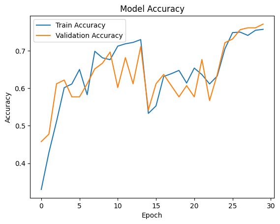 | 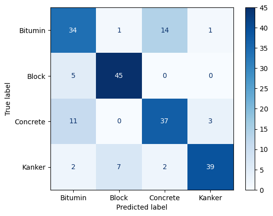 |
| **Model_Architecture(CS200-U).h5** |   90%    | 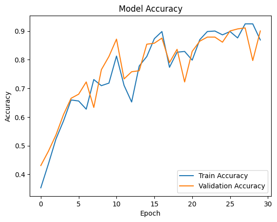 | 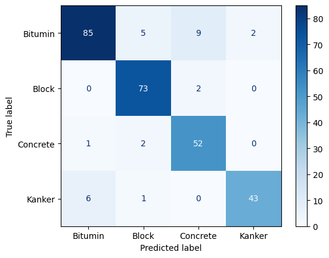 |
| **Model_Architecture(CS250-E).h5** |   64%    | 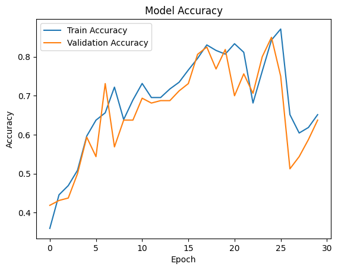 | 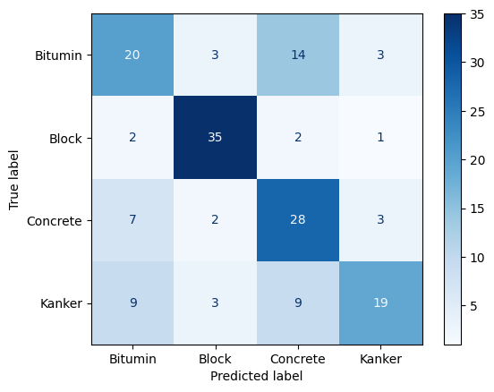 |
| **Model_Architecture(CS250-U).h5** |   83%    | 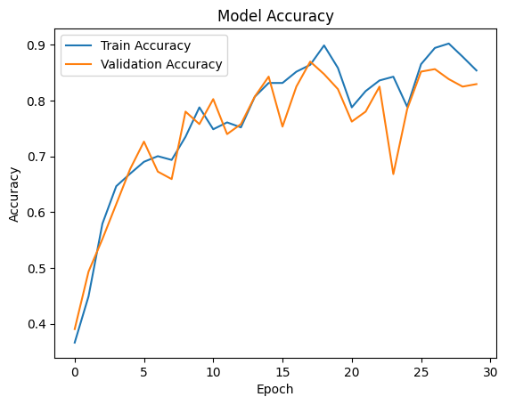 | 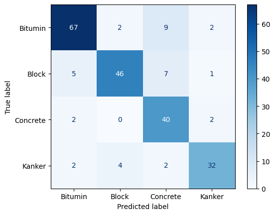 |
| **Model_Architecture(CS300-E).h5** |   88%    | 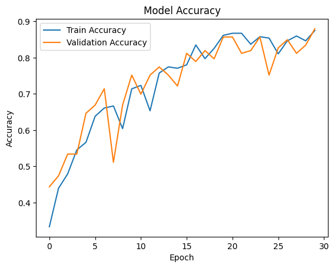 | 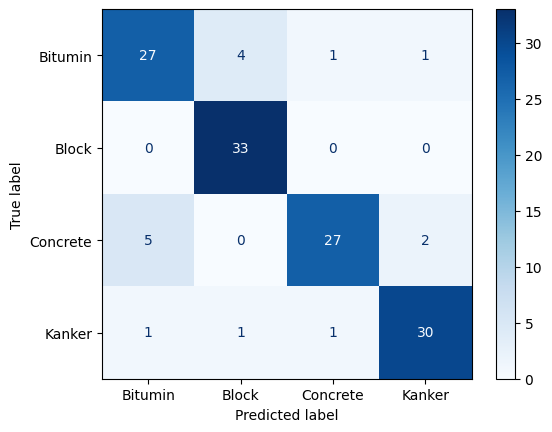 |
| **Model_Architecture(CS300-U).h5** |   75%    | 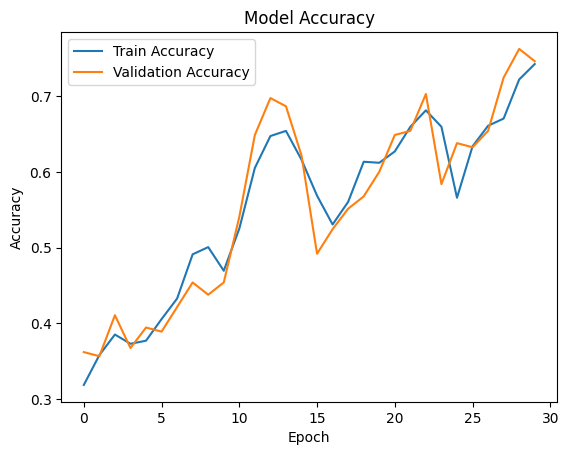 | 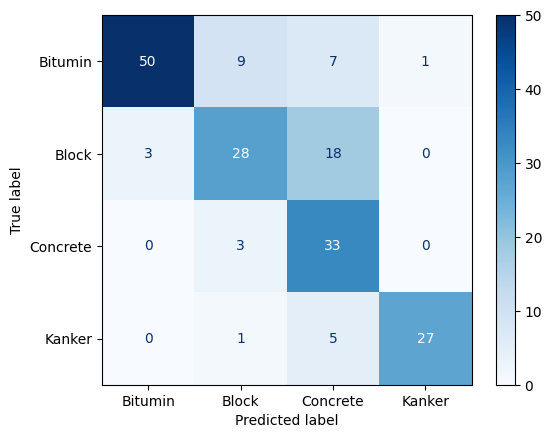 |

---

## Second Iteration

### Model Architecture

```python
model = Sequential([
    Bidirectional(LSTM(128, return_sequences=True), input_shape=(200, 6)),
    BatchNormalization(),
    Dropout(0.4),

    Bidirectional(LSTM(64)),
    BatchNormalization(),
    Dropout(0.4),

    Dense(64, activation='relu'),
    Dropout(0.3),
    Dense(4, activation='softmax')
])

model.compile(
    optimizer='adam',
    loss=focal_loss(gamma=2., alpha=0.25),
    metrics=['accuracy']
)

model.summary()

# --------------------- Train Model ---------------------

history = model.fit(
    X_train, y_train,
    validation_data=(X_val, y_val),
    epochs=50,
    batch_size=32,
    class_weight=class_weights,
    callbacks=[tf.keras.callbacks.EarlyStopping(patience=6, restore_best_weights=True)]
)
```

### Table of Results

|              Model Name              | Accuracy |                                   Accuracy Curve                                   |                                    Confusion Matrix                                    |
| :----------------------------------: | :------: | :--------------------------------------------------------------------------------: | :------------------------------------------------------------------------------------: |
| **Model_Architecture(CS200-U)CB.h5** |    81    | 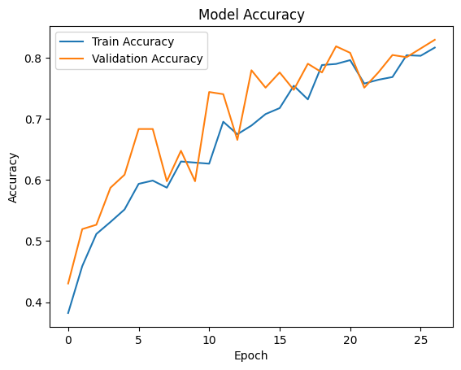 |  |
| **Model_Architecture(CS250-U)CB.h5** |    85    | 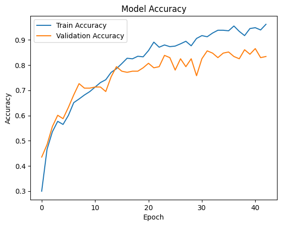 |  |
| **Model_Architecture(CS300-U)CB.h5** |    81    | 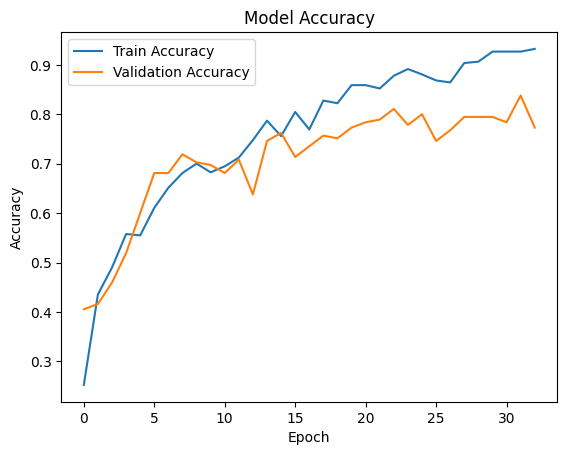 | 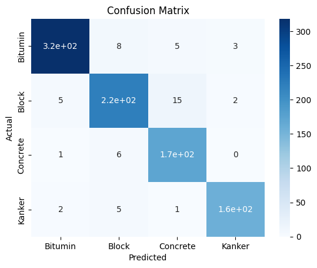 |
